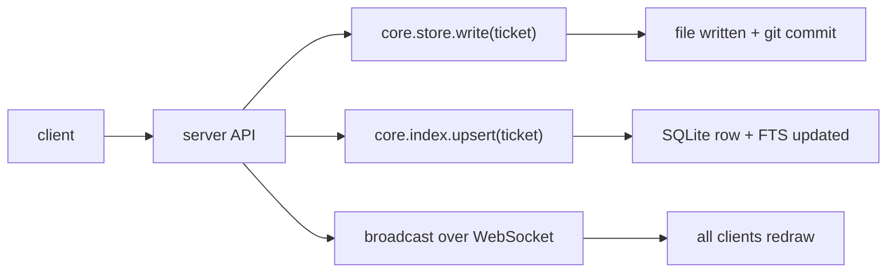
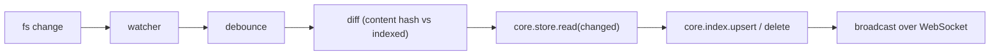
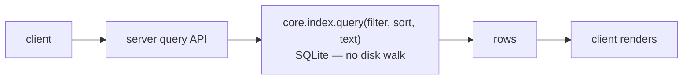

# 01. Architecture Overview

## 1.1 The shape

Hot Sheet 2 is built as **one core library** with thin surfaces around it. The
core owns all domain logic; the surfaces are adapters.

> Diagram source: [`diagrams/src/architecture.html`](diagrams/src/architecture.html)
> → rendered to [`diagrams/architecture.svg`](diagrams/architecture.svg) with
> `domotion capture` (see [diagrams/README.md](diagrams/README.md)).

## 1.2 Components

### hotsheet-core (library)
The heart. Everything domain-specific lives here so it is written and tested
once. It is **I/O-capable but policy-free**: it reads/writes files and spawns
processes through injected adapters, so it can be unit-tested against in-memory
fakes and linked into its **two host binaries — the server and the CLI** (clients
are not hosts; they use the server's API). See
[04-core-server-cli.md](04-core-server-cli.md).

Key modules:
- **model** — `Ticket`, `Note`, `Attachment`, `Category`, `Store`, `Project`,
  status/priority enums, the claim/lease fields.
- **store** — read/write/commit ticket files in a git-backed store; multi-store
  resolution. [02-ticket-storage.md](02-ticket-storage.md).
- **index** — SQLite schema, upsert-from-file, query, FTS.
  [03-indexing-and-query.md](03-indexing-and-query.md).
- **watch** — filesystem notifications → debounced incremental reindex.
- **query** — the list/filter/search/sort surface the UI and CLI call.
- **plugins** — AI-tool plugin registry + capability traits; the terminal
  manager and permission bridge. [05-ai-tool-plugins.md](05-ai-tool-plugins.md).
- **coord** — claim/lease primitive for distributed drain.

### hotsheet-server (binary)
A thin `axum`/`tokio` process that wraps the core and exposes:
- **REST** over HTTP for CRUD/query.
- **WebSocket** for live push (index changes, claims, terminal streams,
  permission prompts).
- **MCP** for AI tools (the `hotsheet_*` tool surface).
- The **filesystem watcher** and **terminal/PTY manager** run here (they need a
  long-lived process).

Runs completely independently of any client. Multiple clients (local and remote)
attach to one server. See [04-core-server-cli.md](04-core-server-cli.md) §4.3.

### hotsheet-cli (binary)
A thin `clap` process that wraps the core for **direct-to-disk** operations —
create/list/edit/search/complete tickets without a running server. When a server
is running, disk changes it makes are picked up by the watcher and reindexed.
Also hosts developer/ops commands (`init`, `migrate`, `reindex`, `serve`,
`doctor`). See [04-core-server-cli.md](04-core-server-cli.md) §4.4.

### Clients
**Pure consumers of the server API in every case — no client ever embeds the
core.** A local project and a remote project differ only in *which* server the
client talks to (a localhost server vs. a remote origin); the client is the same
thin HTTP/WS/MCP consumer either way.
- **Tauri desktop** — a Rust shell hosting a web UI. It **auto-starts and
  supervises the local server** when none is running, then talks to it over
  HTTP/WS; for a remote project it talks HTTP/WS over mTLS.
- **SwiftUI (macOS/iOS)** — native app over HTTP/WS. macOS auto-starts the local
  server; iOS is remote-first (it connects to a Mac's server).
- **Android (later)** — same API, a Kotlin/Compose UI.

The auto-started server is **detached and outlives the client** — closing the app
leaves the server running. See [06-clients.md](06-clients.md) and
[04-core-server-cli.md](04-core-server-cli.md) §4.3.

## 1.3 Data flow

**Write path (create/edit a ticket):**

The CLI and a direct text-editor edit skip the API: they write the file, and the
watcher path below reconciles the index.

**Reconcile path (a file changed on disk out-of-band):**

**Read path (draw the list / search):**

The UI never walks the store directory to draw a list; it always reads the index.

## 1.4 Process & trust model

- **The server is a standalone process in every case — local included.** There is
  no embedded-in-the-client mode. A client that finds no server running
  **auto-starts one, detached**, and connects to it; the server **survives the
  client closing**. One local server instance per machine serves every local
  project (the HS1 instance model). Lifecycle detail:
  [04-core-server-cli.md](04-core-server-cli.md) §4.3.
- **Local (Tier 0):** loopback HTTP, per-project shared secret. The server trusts
  anything that presents the secret from localhost. Same as HS1. **mTLS is
  optional even locally** (§4.6) — worth it on a shared multi-user machine where
  another local user could otherwise reach the port; unnecessary on a
  single-user box.
- **Exposed (Tier 1):** binding off-loopback requires mTLS + per-device client
  certs + ACLs, or the server refuses to start. Carried over from HS1's shipped
  §94/§97/§112 remote design. See [08-distributed-and-remote.md](08-distributed-and-remote.md).
- **One writer per store working copy at a time** for the *index* is enforced by a
  lock; git itself arbitrates concurrent *content* edits via normal merge. The
  index is per-machine and disposable, so cross-machine index locking is a
  non-issue.

## 1.5 What is deliberately NOT a component

- **No ORM, no migrations-as-code for user data.** The "schema" is the ticket file
  format (versioned in frontmatter). The SQLite index has its own schema, but it is
  disposable and rebuilt, so its migrations are "drop and rebuild," not data
  migrations.
- **No server-rendered UI.** HS1 rendered HTML on the server via a custom JSX
  runtime. HS2 clients are native/SPA and the server speaks data (JSON), not
  markup. This is the client/service split the rewrite is chartered to make.
- **No first-class AI tool.** There is no "Claude module" the server imports;
  Claude is a plugin like any other. See [05-ai-tool-plugins.md](05-ai-tool-plugins.md).

## 1.6 Cross-references
- Technology choices and rationale: [09-technology-decisions.md](09-technology-decisions.md)
- Storage: [02-ticket-storage.md](02-ticket-storage.md)
- Indexing: [03-indexing-and-query.md](03-indexing-and-query.md)
